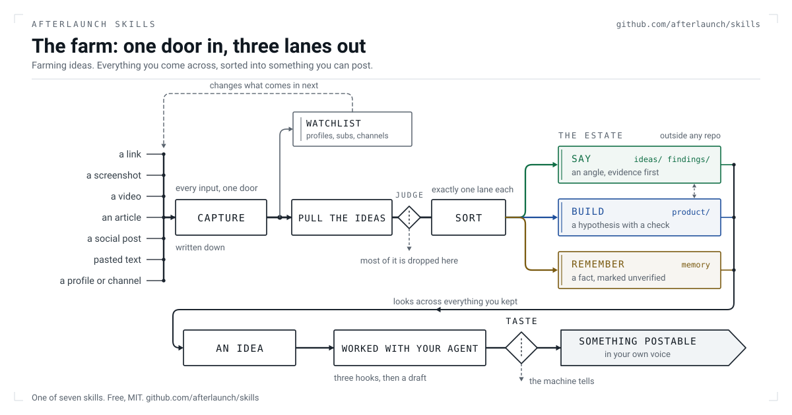

# AfterLaunch skills

Growth skills for AI visibility and SEO, from the team building
[AfterLaunch](https://afterlaunch.io), the organic growth engine.

What they do: get you posting useful things regularly, in your own voice, so
the gaps in how AI answers and search find you start closing. Free, MIT, and
useful on their own. Better pointed at [AfterLaunch](https://afterlaunch.io).

7 so far. More dropping. 
This is an active repo, 
contributors welcome.
rules : submit new or improve existing skills that help founders grow their business.

# Start here: 

## product-context

Writes `product-context/PRODUCT.md`. Your business in a nutshell. What you sell, who for, 
what you can prove, the words you keep and the words you refuse. Everything else reads it.
Skip it and an agent invents your company off your landing page, and every
draft after that inherits the invention.

The free Growth Snapshot at [afterlaunch.io](https://afterlaunch.io) is a fully comprehensive Business Snapshot 
that lays the foundation for much better alignment in terms of content, relevance, and voice match.

While it's not necessary to use AfterLaunch's Growth Snapshot, it comes with a free trial (and is like really really good I heard :P) 
and after the trial ends you'll have learned how best to use the skills, and if you don't want to buy an AfterLaunch subscription, 
you can still run these skills yourself manually and get value out of them :)


## farm

The Farm is everything. Douglas Adams may have said that at some point. Who knows. I just said it. so there.

Farming ideas. Everything you come across in a day goes in one door, and gets stored in a numbers of ways.
Into something to say, something to build, or something to remember. The beauty is that this is all asyncronous.

In Claude Code, its just `/farm 'foo' where foo = a url, a video/image/text or combination thereof, type something, doodle`

The other end of this is the Content Production Pipeline - on any occassion when you want to post, 
you can make your AI look across everything you kept and it hands you an
idea from your content ingestion async pipeline instead of randomly generating something.

If used well, you can mine active social topics and threads on communities to find in-vogue topics and come up with your own perspective.
You can build a pretty great content calendar.

Nobody runs out of ideas. They run out of the ones they forgot to write down. 
This becomes your always accessible note-taker-brain interface directly connected to your content and product dev pipeline, 
so you can go from idea to quality shipped assets in no time.

<picture>
  <source media="(prefers-color-scheme: dark)" srcset="assets/farm-dark.svg">
  
</picture>


## The other five

**`voice`** shows you two sentences, you pick the closer one. Out comes a
profile the drafting skills obey.

**`draft`** three hooks with the reasoning, then one draft per platform.

**`tells`** the de-slop pass. One register of what gives machine writing away,
quoting the line that failed. Worth running on things you wrote yourself.

**`reddit-desk`** reads 28 subreddits' own rules before writing a word. Nine
of them ban naming your product outright. It checks whether you are banned
there, keeps a budget per sub for how often you may mention yourself, and
refuses a reply too close to one you already left, because on some subs a
near-duplicate inside twenty-four hours costs a seven day ban and then a
permanent one. It never posts.

**`session-recap`** what you shipped, how it works in plain words, what you
left unfinished.

Four of them read `product-context/PRODUCT.md`. `draft` stops rather than
guess when it is missing.

## Connectors

Most places have no usable write path for one person, so the road is an agent
driving a browser you are already signed into. The skill carries the brief,
not the automation: your agent drives, and we hold no credentials for anyone.
No browser agent, and the skill hands you the finished post and the URL to
paste it into.

It fills the composer and stops before submit. You press the button. That one
does not change.

## Install

These are instructions, not software. There is nothing to build and nothing
to depend on, so pick whichever of these three you are.

**Hand this to your agent.** Claude Code, Codex, Cursor, Copilot, Gemini CLI,
Windsurf, Aider, or anything else that can run a command. Paste this:

```
Clone https://github.com/afterlaunch/skills. Read skills/product-context/SKILL.md
and follow it to build my product context. Every skill is a folder under skills/
with a SKILL.md you follow literally, so read the whole file before running one.
Then tell me which skill to run next and why.
```

That is the entire installation.

**On Claude Code there is a shortcut:**

```
/plugin marketplace add afterlaunch/skills
/plugin install afterlaunch-skills@afterlaunch-skills
```

**No terminal at all?** Open any `SKILL.md` on this page, copy the whole file,
paste it into ChatGPT, Claude, Gemini or whatever you use, and say follow this.
Everything works as plain instructions. The Reddit desk is the only skill with
scripts, and they are optional.

Whichever way you came in, run `product-context` first. The skills share one
directory: `SKILLS_ESTATE` points at it, and defaults to `~/.claude/content`.

Every skill ships a runnable offline eval, if you want to check it yourself:

```
for s in skills/*/; do python3 "$s/evals/run.py"; done
```

## With AfterLaunch

The skills do the making. [AfterLaunch](https://afterlaunch.io) does the
knowing: what the engines say about you, what moved since last week, what to
do next, and whether it worked.

A skill runs once and forgets. Set `AFTERLAUNCH_API_KEY`, add the MCP server
(setup in [afterlaunch/mcp](https://github.com/afterlaunch/mcp)), and these
work your ranked board instead of a local folder. A thread they find lands on
it, a draft saves against its move, and what you learn about a venue stays for
every later draft. Shipping stays a human decision.

Without a key they run the same way against files on your machine.

## House rules

- The venue's rules win. Zero product budget where promotion is banned.
- Drafts are raw material for your rewrite, never finished comments.
- A number without its scope is not used. The caveat travels with the claim.
- British English, and no em-dashes.
